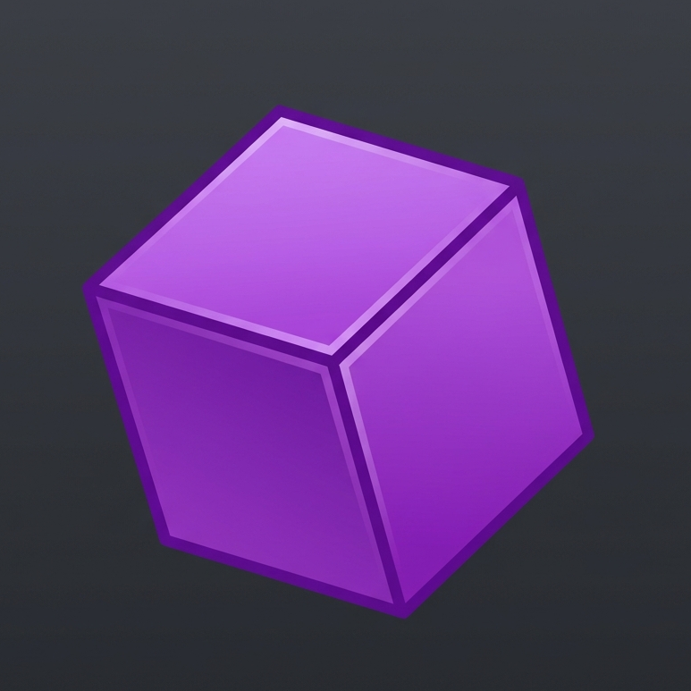

<div align="center">
  <h1>1.21.11 Java Item Backport</h1>
  <br>
  
  <br><br>
  <p><b>Block & Item Model Backport Layer for Minecraft 1.20.1 (Fabric)</b></p>

  <p>
    
    
    
  </p>
</div>

## 📖 Overview

**1.21.11 Java Item Backport** is a lightweight Fabric utility/library mod for **Minecraft 1.20.1**. 

As Minecraft's internal model engine updates, map makers, modders, and resource pack creators often face limitations when trying to implement modern JSON models on older versions. By porting the handling of **1.21.11+ block and item JSON models**, it allows them to be natively read, loaded, and rendered in **1.20.1**.

## ✨ Features

- **Modern Model Formatting:** Seamlessly load block and item model JSONs formatted for the newest Minecraft versions.
- **Arbitrary Rotation Angles:** Break free from the standard 22.5° limits! Full support for arbitrary rotation angles generated via Blockbench, allowing for much more complex and detailed block/item shapes.
- **Zero FPS Impact:** The mod handles all complex 3D math and trigonometry strictly during the "Baking" stage (when the game or resource packs load). The rendering cycle is as optimized as vanilla Minecraft!
- **Transparent Rendering API:** Hook directly into the custom Model Loading Plugin to process modern JSON models exactly as modern Minecraft would, complete with fallback protections to prevent vanilla model crashes.

## 🛠️ For Developers / Modders

This mod is built primarily as a **library dependency** for other mods to rely upon. 
If you are developing a mod on 1.20.1 but want to use custom models exported from the newest Blockbench versions (or rely on arbitrary rotation), easily implement this mod by depending on it. 

### Usage Example
Add it as a dependency in your `fabric.mod.json`:
```json
"depends": {
  "newjavabackport": "*"
}
```

The mod automatically handles:
- Custom json serialization.
- Custom `ModelLoadingPlugin` interactions.
- Re-baking and processing modern arbitrary `Cube`, `Face`, and multi-axis `Rotation` parameters.

## 🎮 For Players

If another mod directed you here, simply drop the released `.jar` file into your `mods` folder.
It does not add any new content by itself but provides the necessary model loading foundation for other mods to shine!

## 📦 Requirements

- **Minecraft:** 1.20.1
- **Mod Loader:** Fabric Loader (>=0.16)
- **Dependencies:** [Fabric API](https://modrinth.com/mod/fabric-api)

## 🏗️ Building from Source

To compile the mod yourself:
1. Clone the repository: `git clone https://github.com/Bay4lly/1.21.11-Java-Item-Model-Backport.git`
2. Open a terminal in the folder.
3. Run the Gradle build command:
   ```bash
   ./gradlew build
   ```
4. Find the compiled `.jar` inside `build/libs/`.

---

### 🐛 Issues & Contributing
If you run into issues with a model compiling improperly or loading visually broken, please open an issue in the **Issues** tab. Contributions and Pull Requests are always welcome!

**License:** MIT 
